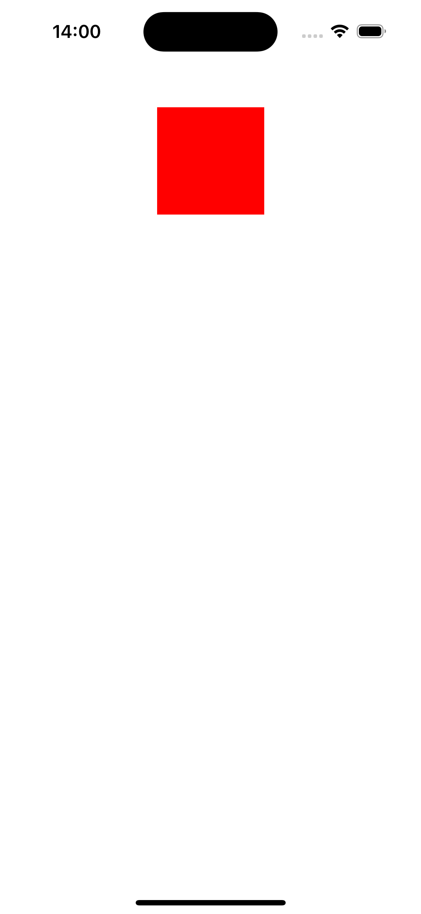

# UIKit Dynamics Overview

## What is UIDynamicAnimator?

UIDynamicAnimator is a feature in UIKit that provides physics-related capabilities and animations for dynamic items. It simulates physics behaviors such as gravity, collisions, and item interactions.

## How to Use UIDynamicAnimator?

To use UIDynamicAnimator, implement the UIDynamicItem protocol, which is already adopted by default by UIView and UICollectionViewLayoutAttributes.

## What is UIDynamicItem?

UIDynamicItem is a set of methods that allow custom objects to participate in UIKit Dynamics. It includes required methods like bounds, center, and transform, along with optional methods like collision bounds type and collision bounding path.

## Configuration:

Configure UIDynamicAnimator by adding dynamic behaviors to it. Default behaviors include UICollisionBehavior, UIDynamicItemBehavior, UIGravityBehavior, UIPushBehavior, and UISnapBehavior. Custom behaviors can be created by inheriting from the UIDynamicBehavior class.

## Interaction with Dynamic Items:

- Before adding an item to a behavior, determine its starting position, rotation, and bounds.
- After adding the behavior to an animator, the animator updates the item's position and rotation.
- during the animation. Use the `updateItem(usingCurrentState:)` function to control item properties during the animation.

For more information:
- [UIDynamicAnimator Documentation](https://developer.apple.com/documentation/uikit/uidynamicanimator)
- [UIDynamicItem Documentation](https://developer.apple.com/documentation/uikit/uidynamicitem)
- [UIDynamicBehavior Documentation](https://developer.apple.com/documentation/uikit/uidynamicbehavior)

## UIKit Dynamics Sample Code

This repository contains sample code demonstrating the usage of `UIDynamicAnimator` in UIKit to create physics-based animations. Specifically, it focuses on combining `UIGravityBehavior` with `UICollisionBehavior` to simulate gravity and collisions within a UIView.

Note: All codes are created in the playground.

1. **Adding a Box to the ViewController**
```swift
import UIKit
import PlaygroundSupport

class GravityViewController: UIViewController {
 
    var box: UIView!
    
    override func loadView() {
        let view = UIView()
        view.backgroundColor = .white
        self.view = view
    }
    
    override func viewDidLoad() {
        super.viewDidLoad()
        
        setupBox()
    }
    
    func setupBox() {
        box = UIView()
        box.backgroundColor = .red
        box.translatesAutoresizingMaskIntoConstraints = false
        view.addSubview(box)

        NSLayoutConstraint.activate([
            box.centerXAnchor.constraint(equalTo: view.centerXAnchor),
            box.topAnchor.constraint(equalTo: view.topAnchor, constant: 20),
            box.heightAnchor.constraint(equalToConstant: 100),
            box.widthAnchor.constraint(equalToConstant: 100)
        ])
    }
}

```


2. **Create UIDynamicAnimator**

To create an animator, we pass the view as a reference, which serves as the reference for the coordinate system and behaviors.

```swift
var animator: UIDynamicAnimator!

override func viewDidLoad() {
        super.viewDidLoad()
        
        setupBox()
        setupAnimator()
    }
    
    
    func setupAnimator() {
        animator = .init(referenceView: view)
    }
```

3. **Create GravityBehavior**

```swift
var gravity: UIGravityBehavior!

override func viewDidLoad() {
        super.viewDidLoad()
        
        setupBox()
        setupAnimator()
        setupBehavior()
    }

func setupBehavior() {
        gravity = .init()        
        animator.addBehavior(gravity)
    }
```
In this case, nothing special happens because we didn't add the box object to the gravityBehavior as an item.

4. **Add Item to Behavior**
```swift
func setupBehavior() {
        gravity = .init()
        animator.addBehavior(gravity)
        
        // new line
        gravity.addItem(box)
    }
```
The program doesn't work as expected and crashes because the coordinates for the box object haven't been set up yet, due to our use of autolayout. To solve this issue, we have two solutions: either set the frame for the object or add it to gravity after the coordinates for the box object are determined.

5. **Fix problem**
```swift
override func touchesBegan(_ touches: Set<UITouch>, with event: UIEvent?) {
        super.touchesBegan(touches, with: event)
        
        gravity.addItem(box)
    }
```

or
```swift
// inside setupBox function comment change first line to below code 
//        box = UIView()
        box = UIView(frame: .init(x: 200, y: 10, width: 100, height: 100))
```
I place adding the box object to gravity when the screen is touched. (approach one)
After completing step 5, you will be able to observe the effect of gravity on the box object.


6. **Change Gravity Direction**
By changing the direction of gravity, the object's movement along the x-axis also changes accordingly. We can set any direction by adjusting the values of dx and dy.
```swift
    func setupBehavior() {
        gravity = .init()
        animator.addBehavior(gravity)
        
        // new line
//        gravity.gravityDirection = .init(dx: 0.0, dy: 1.0) // default value
        gravity.gravityDirection = .init(dx: 1.0, dy: 0.0)
//        gravity.gravityDirection = .init(dx: 0.1, dy: 0.5)
//        gravity.gravityDirection = .init(dx: 0.1, dy: -1.0)
    }
```


7. **Change magnitude**
``` swift
    func setupBehavior() {
        gravity = .init()
        animator.addBehavior(gravity)
        
//        gravity.gravityDirection = .init(dx: 0.0, dy: 1.0) // default value
        gravity.gravityDirection = .init(dx: 1.0, dy: 0.0)
//        gravity.gravityDirection = .init(dx: 0.1, dy: 0.5)
//        gravity.gravityDirection = .init(dx: 0.1, dy: -1.0)
        
        // new line
//        gravity.magnitude = 1.0 // default valaue 1000 points / second * second
        gravity.magnitude = 0.1
//        gravity.magnitude = 0.0
    }
```
Setting the value of this property to 0.0 creates the vector (0.0, 0.0) and resets the angle property to 0.0 radians. If you make subsequent changes to this property, also remember to update the angle property.

8. **Control animation on each step**
```swift
// new variable
var counter = 0

    func setupBehavior() {
        gravity = .init()
        animator.addBehavior(gravity)
        
        gravity.gravityDirection = .init(dx: 0.0, dy: 1.0) // default value
//        gravity.gravityDirection = .init(dx: 1.0, dy: 0.0)
//        gravity.gravityDirection = .init(dx: 0.1, dy: 0.5)
//        gravity.gravityDirection = .init(dx: 0.1, dy: -1.0)
        
        gravity.magnitude = 1.0 // default valaue 1000 points / second * second
//        gravity.magnitude = 0.1
//        gravity.magnitude = 0.0
        
        // new line
        gravity.action = { [weak self] in
            guard let self else { return }
            counter += 1
            if counter == 50 {
                gravity.gravityDirection = .init(dx: 0.0, dy: -1.0)
            }
        }
    }
```


9. **Additional Behavior**
Finally, we add a UICollisionBehavior to set up boundaries for the object.
```swift
// new line
var collision: UICollisionBehavior!

// new function
func setupCollision() {
        collision = .init()
        animator.addBehavior(collision)
        
        collision.translatesReferenceBoundsIntoBoundary = true
    }
    
    override func viewDidLoad() {
        super.viewDidLoad()
        
        setupBox()
        setupAnimator()
        setupBehavior()

        // new line
        setupCollision()
    }
    
    override func touchesBegan(_ touches: Set<UITouch>, with event: UIEvent?) {
        super.touchesBegan(touches, with: event)
        
        gravity.addItem(box)

        // new line
        collision.addItem(box)
    }
```


10. **final code**
```swift
import UIKit
import PlaygroundSupport

class GravityViewController: UIViewController {
 
    var animator: UIDynamicAnimator!
    var box: UIView!
    var gravity: UIGravityBehavior!
    var counter = 0
    var collision: UICollisionBehavior!
    
    override func loadView() {
        let view = UIView()
        view.backgroundColor = .white
        self.view = view
    }
    
    override func viewDidLoad() {
        super.viewDidLoad()
        
        setupBox()
        setupAnimator()
        setupBehavior()
        setupCollision()
    }
    
    func setupBox() {
        box = UIView()
//        box = UIView(frame: .init(x: 200, y: 10, width: 100, height: 100))
        box.backgroundColor = .red
        box.translatesAutoresizingMaskIntoConstraints = false
        view.addSubview(box)

        NSLayoutConstraint.activate([
            box.centerXAnchor.constraint(equalTo: view.centerXAnchor),
            box.topAnchor.constraint(equalTo: view.topAnchor, constant: 20),
            box.heightAnchor.constraint(equalToConstant: 100),
            box.widthAnchor.constraint(equalToConstant: 100)
        ])
    }
    
    func setupAnimator() {
        animator = .init(referenceView: view)
    }
    
    func setupBehavior() {
//        gravity = .init(items: [box]) // crash
        gravity = .init()
        animator.addBehavior(gravity)
        
//        gravity.addItem(box) // crash
        
        gravity.gravityDirection = .init(dx: 0.0, dy: 1.0) // default value
//        gravity.gravityDirection = .init(dx: 1.0, dy: 0.0)
//        gravity.gravityDirection = .init(dx: 0.1, dy: 0.5)
//        gravity.gravityDirection = .init(dx: 0.1, dy: -1.0)
        
        gravity.magnitude = 1.0 // default valaue 1000 points / second * second
//        gravity.magnitude = 0.1
//        gravity.magnitude = 0.0
        
        gravity.action = { [weak self] in
            guard let self else { return }
            counter += 1
            if counter == 50 {
                gravity.gravityDirection = .init(dx: 0.0, dy: -1.0)
            }
        }
    }
    
    func setupCollision() {
        collision = .init()
        animator.addBehavior(collision)
        
        collision.translatesReferenceBoundsIntoBoundary = true
    }
    
    override func touchesBegan(_ touches: Set<UITouch>, with event: UIEvent?) {
        super.touchesBegan(touches, with: event)
        
        gravity.addItem(box)
        collision.addItem(box)
    }
}

PlaygroundPage.current.liveView = GravityViewController()

```