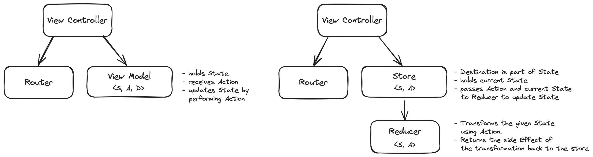

# Blu Architecture vs. TCA

# Resources

- swift-perception: Back-ported version of Apple's Observation framework ([Link](https://github.com/pointfreeco/swift-perception))
- Yielding Accessors: `_read` and `_modify` ([Link](https://trycombine.com/posts/swift-read-modify-coroutines/))
- Composable Architecture:
    - Point Free ([Link](https://www.pointfree.co/collections/composable-architecture/composable-architecture-1-0))
    - Docs ([Link](https://swiftpackageindex.com/pointfreeco/swift-composable-architecture/1.9.2))
- Sendable and @Sendable explained ([Link](https://www.avanderlee.com/swift/sendable-protocol-closures))
