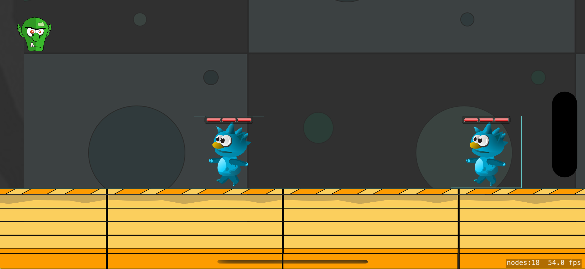

## What is bodyguard?

In this game, a number of enemies are created and they move towards the end of the path. To prevent the enemies from reaching the end, the player needs to hit them. Each enemy needs to be hit three times by the player.

## Screenshots 🌃

