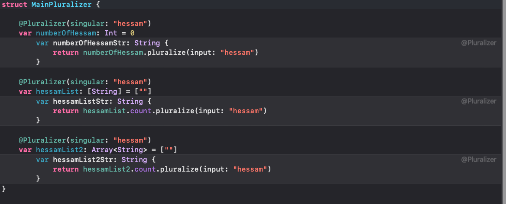

# Macro Overview

Swift macros generate code at compile time, helping to avoid repetitive code. They add new code alongside existing code without modifying or deleting any existing code.

## Macros type
Swift has two kinds of macros:

Freestanding macros appear on their own, without being attached to a declaration.
Attached macros modify the declaration that they’re attached to.

Both attached and freestanding macros in Swift follow the same model for expansion and are implemented using the same approach.

### Freestanding
To call a freestanding macro, you write a number sign (#) before its name, and you write any arguments to the macro in parentheses after its name. For example:

```swift
func myFunction() {
    print("Currently running \(#function)")
}

```

### Attached Macros
To call an attached macro, you write an at sign (@) before its name, and you write any arguments to the macro in parentheses after its name.

Attached macros in Swift modify the declaration they are attached to by adding code, such as defining a new method or adding conformance to a protocol.

## Macro Declarations
In Swift, macros have separate declaration and implementation. The declaration specifies the macro's name, parameters, usage scope, and generated code. The implementation contains the code that expands the macro by generating Swift code. Macros are introduced with the `macro` keyword.

#### Note:
Macros are always declared as public. Because the code that declares a macro is in a different module from code that uses that macro, there isn’t anywhere you could apply a nonpublic macro.

example:
```swift
public macro OptionSet<RawType>() =
        #externalMacro(module: "SwiftMacros", type: "OptionSetMacro")
```

### Macro Roles
A macro declaration defines the macro’s roles — the places in source code where that macro can be called, and the kinds of code the macro can generate. Every macro has one or more roles, which you write as part of the attributes at the beginning of the macro declaration.

#### Peer macros
its implementation type conforms to the PeerMacro protocol. These macros create new declarations within the same scope as the one they're attached to. For instance, when applied to a structure's method, they can define extra methods and properties for that structure.

#### Member macros
its implementation type conforms to the MemberMacro protocol. These macros generate new declarations that become members of the type or extension to which the macro is attached. For example, applying a member macro to a structure declaration can define additional methods and properties within that structure.

#### Member attribute
type implementing the macro must conform to the MemberAttributeMacro protocol. These macros are used to add attributes to members of the type or extension they are attached to.

#### Accessor macros
the type implementing the macro must conform to the AccessorMacro protocol. These macros add accessors to the stored property they are attached to, converting it into a computed property.

#### Extension macros
The implementing type adheres to the ExtensionMacro protocol. These macros can extend a type with protocol conformance, a where clause, and new member declarations. If adding protocol conformances, use the "conformances" argument to specify them. Extension macros on nested types expand to top-level extensions in the file.

#### name
Peer, member, and accessor macros require a "names:" argument, listing the names of the generated symbols. Extension macros also need a "names:" argument if they add declarations within the extension. When a macro declaration includes "names:", the implementation must generate symbols only for those listed names, but it's not mandatory to generate a symbol for every listed name.

##### named
named(<#name#>) where name is that fixed symbol name, for a name that’s known in advance.

##### overloaded
overloaded for a name that’s the same as an existing symbol.

##### prefixed
prefixed(<#prefix#>) where prefix is prepended to the symbol name, for a name that starts with a fixed string.

##### suffixed
suffixed(<#suffix#> where suffix is appended to the symbol name, for a name that ends with a fixed string.

##### arbitrary
arbitrary for a name that can’t be determined until macro expansion.


## Create Simple Macro (Pluralizer)
This macro is used to construct the plural form of words, applied to variables to generate a string representing their plural or singular form based on certain conditions. It's applicable only to Int and Array types, but we can extend it to support other types as well.

### declaration

```swift
@attached(peer, names: arbitrary)
public macro Pluralizer(singular: StaticString) = #externalMacro(module: "PluralizerMacros", type: "PluralizerMacro")
```

### extension

```swift
public extension Array {
    
    func pluralize(input: String) -> String {
        count.pluralize(input: input)
    }
}

public extension Int {
    
    func pluralize(input: String) -> String {
        if self == 1 {
            return input
        } else {
            // Basic implementation for English language, you may need to extend this for other cases
            if input.hasSuffix("y") {
                let endIndex = input.index(input.endIndex, offsetBy: -1)
                let stem = String(input[..<endIndex])
                return stem + "ies"
            } else {
                return input + "s"
            }
        }
    }
}
```

### useage

```swift
struct MainPluralizer {
    
    @Pluralizer(singular: "hessam")
    var numberOfHessam: Int = 0
    
    @Pluralizer(singular: "hessam")
    var hessamList: [String] = [""]
    
    @Pluralizer(singular: "hessam")
    var hessamList2: Array<String> = [""]
}
```

#### result of expansion


### defination

To define our first unit, we need to create a component of type PeerMacro named PluralizerMacro (we specified this name in the definition). This function should return an array containing the new code snippets.


```swift
public struct PluralizerMacro: PeerMacro {
    
    public static func expansion(of node: SwiftSyntax.AttributeSyntax, providingPeersOf declaration: some SwiftSyntax.DeclSyntaxProtocol, in context: some SwiftSyntaxMacros.MacroExpansionContext) throws -> [SwiftSyntax.DeclSyntax] {
        // TODO: - complete here
    }
}
```
#### show all information

Using the following command, we can view all the information in the tree structure.

```swift
dump(declaration)
```

After placing the above code and executing, the following log will be displayed in the console.

```swift
- VariableDeclSyntax
├─attributes: AttributeListSyntax
│ ╰─[0]: AttributeSyntax
│   ├─atSign: atSign
│   ├─attributeName: IdentifierTypeSyntax
│   │ ╰─name: identifier("Pluralizer")
│   ├─leftParen: leftParen
│   ├─arguments: LabeledExprListSyntax
│   │ ╰─[0]: LabeledExprSyntax
│   │   ├─label: identifier("singular")
│   │   ├─colon: colon
│   │   ╰─expression: StringLiteralExprSyntax
│   │     ├─openingQuote: stringQuote
│   │     ├─segments: StringLiteralSegmentListSyntax
│   │     │ ╰─[0]: StringSegmentSyntax
│   │     │   ╰─content: stringSegment("slide")
│   │     ╰─closingQuote: stringQuote
│   ╰─rightParen: rightParen
├─modifiers: DeclModifierListSyntax
├─bindingSpecifier: keyword(SwiftSyntax.Keyword.var)
╰─bindings: PatternBindingListSyntax
  ╰─[0]: PatternBindingSyntax
    ├─pattern: IdentifierPatternSyntax
    │ ╰─identifier: identifier("slides")
    ├─typeAnnotation: TypeAnnotationSyntax
    │ ├─colon: colon
    │ ╰─type: IdentifierTypeSyntax
    │   ╰─name: identifier("Int")
    ╰─initializer: InitializerClauseSyntax
      ├─equal: equal
      ╰─value: IntegerLiteralExprSyntax
        ╰─literal: integerLiteral("0")
```

The following codes represent the subsequent steps of transformation and reaching different types that we need:

```swift
        // 1
        guard let variableDeclSyntax = declaration.as(VariableDeclSyntax.self) else {
            return []
        }
        
        // 2
        let attributesSyntax = variableDeclSyntax.attributes.compactMap { $0.as(AttributeSyntax.self) }
        guard let attributeSyntax = attributesSyntax.first else {
            return []
        }
        
        // 3
        guard let labeledExprListSyntax = attributeSyntax.arguments?.as(LabeledExprListSyntax.self) else {
            return []
        }
        
        // 4
        let labelSyntax = labeledExprListSyntax.compactMap { $0.as(LabeledExprSyntax.self) }.first
        guard let labelSyntax else { return [] }
        
        // 5
        guard let stringLiteralExprSyntax = labelSyntax.expression.as(StringLiteralExprSyntax.self) else {
            return []
        }
        
        // 6
        let segment = stringLiteralExprSyntax
            .segments
            .compactMap { $0.as(StringSegmentSyntax.self) }
            .first
        guard let segment else { return [] }

        // 7
        let inputParameter = segment.content.text
```

In the first step, we convert "declaration" to "variableDeclaration" because the input to the function is a protocol, and this type is necessary (the main activity observed in the tree is to convert it to the desired type using the "as" function).

In the second step, we need to examine "attributes" to retrieve inputs.

In the third step, to receive the function input, we need to inspect "arguments" and convert it to "LabeledExprListSyntax". Since we have a single argument, in the fourth step, we select the first argument and convert it to the required type.

In the fifth step, because our input is of type string, we convert it to the desired type. In the initial segment part, we select the first item, and in the seventh step, we choose the "text" from "content", which becomes the value of our macro input.


To find the variable name on which the macro is written, we need to look for it in the Bindings section.
```swift
let bindings = variableDeclSyntax.bindings.compactMap { $0.as(PatternBindingSyntax.self) }
        guard let pattern = bindings.first?.pattern.as(IdentifierPatternSyntax.self) else {
            return []
        }
        
        let variableName = pattern.identifier.text
```

To check if the variable type is among our expected types, we need to examine the TypeAnnotations. It's necessary to check whether it's of type ArrayTypeSyntax or IdentifierTypeSyntax.
```swift

// 1
if typeAnnotation.type.is(ArrayTypeSyntax.self) { // [T]
            let pluralizeVariablesDecl =
                                """
                                var \(variableName)Str: String {
                                    return \(variableName).count.pluralize(input: "\(inputParameter)")
                                }
                                """
            
            return [.init(stringLiteral: pluralizeVariablesDecl)]
            
        } else if let typeSyntax = typeAnnotation.type.as(IdentifierTypeSyntax.self) { // Array<T> or Int
            // 2
            let prefixVariableName = if typeSyntax.name.text == "Int" {
                "\(variableName)"
                
            } else if typeSyntax.name.text == "Array" {
                "\(variableName).count"
                
            } else {
                throw PluralizerMacroError.shouldApplyOnIntOrArray
            }
            
            let pluralizeVariablesDecl =
                                """
                                var \(variableName)Str: String {
                                    return \(prefixVariableName).pluralize(input: "\(inputParameter)")
                                }
                                """
            
            return [.init(stringLiteral: pluralizeVariablesDecl)]
            
        } else {
            // TODO: - handler other type such as Dictionary, Set and etc.
            // 3
            return []
        }
```

In the first section, because it's an array, we need to use its count and finally use our desired function. For this purpose, we create a string where we include the name of the new variable based on the current variable name along with the entered data. Then, using the constructor, we return the string.
```swift
[.init(stringLiteral: pluralizeVariablesDecl)]
```

In the second part, we check whether its type is definitely Int or Array. Otherwise, we generate a compiler error and throw it. The reason for considering Array here depends on the type of array definition, which may involve using Array<T>.

In the third part, it may include other types for which it currently performs no action and simply returns an empty array. If it returns an empty array, nothing new is added.

### resourses:
[https://docs.swift.org/swift-book/documentation/the-swift-programming-language/macros/](https://docs.swift.org/swift-book/documentation/the-swift-programming-language/macros/)
[https://docs.swift.org/swift-book/documentation/the-swift-programming-language/attributes/#attached](https://docs.swift.org/swift-book/documentation/the-swift-programming-language/attributes/#attached)